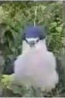
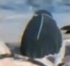
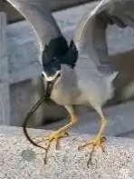

# Awesome-Black-Crowned-Heron

Awesome list of Black-crowned heron.

This repository holds a joke of the comprehensiveness of black-crowned heron  -- The Black-crowned Heron Universe.

中华田园企鹅大全

# 常见鸟类辨识图鉴
|||||
|:--:|:--:|:--:|:--:|
|海鸥|鸊鷉|企鹅|苇鳽|
|Seagull|Grebes|Penguin|Bitterns|

|||||
|:--:|:--:|:--:|:--:|
|游隼|水鸡|星鸦|鸬鹚|
|Peregrine falcon|Moorhen|Northern nutcracker|Great cormorant|

|||||
|:--:|:--:|:--:|:--:|
|潜鸟|秃鹫|鹭鸨|鱼狗|
|Common loon|Vulture|Kori bustard|Water Kingfisher|

|||||
|:--:|:--:|:--:|:--:|
|三趾鹑|鹗|白胸苦恶鸟|白鹡鸰|
|Buttonquail|Osprey|White-breasted waterhen|White wagtail|

|||||
|:--:|:--:|:--:|:--:|
|旋壁雀|猫头鹰|鸳鸯|Kiwi
|Wallcreeper|Owl|Mandarin duck|Kiwi|

|||||
|:--:|:--:|:--:|:--:|
|领角鸮|鲸头鸛（幼鸟）|笑翠鸟|蟑螂|
|Collared scops owl|Shoebill (Nestling)|Laughing kookaburra|Cockroach|

|||||
|:--:|:--:|:--:|:--:|
|风神翼龙（幼鸟）|孔雀|SU-27|不明飞行物|
|Quetzalcoatlus (Nestling)|Peafowls|SU-27|UFO|

|||||
|:--:|:--:|:--:|:--:|
|海南鳽|夜鹭|白眼鸥|走鹃|
|White-eared night heron|Black-crowned heron|White-eyed Gull|Greater roadrunner|

|||||
|:--:|:--:|:--:|:--:|
|毛毛虫|天线宝宝|风筝|黑翅鸢|
|Caterpillar|Teletubbies|Paper Kite|Black-winged kite

|||||
|:--:|:--:|:--:|:--:|
|雨燕|狗|蜂鸟|白胸翡翠|
|Swift|Dog|Hummingbirds|White-throated kingfisher|

|||||
|:--:|:--:|:--:|:--:|
|半蹼鹬|YF21|蝙蝠侠|鹦鹉|
|Asian dowitcher|YF21|Batman|Parrots|

|||||
|:--:|:--:|:--:|:--:|
|科比|乌鸦|苍鹭|迅猛龙|
|Kobe Bryant|Crow|Grey heron|Velociraptor|

|||||
|:--:|:--:|:--:|:--:|
|保龄球|黑冠鳽|沙槌|绣眼鸟|
|Bowling Ball|Malayan night heron|Maraca|Warbling white-eye|

|||||
|:--:|:--:|:--:|:--:|
|红耳鹎|绿头鸭|白头海雕|鸵鸟|
|Red-whiskered bulbul|Mallard|Bald eagle|Ostrich|

|||||
|:--:|:--:|:--:|:--:|
|斑头雁|蛇雕|蝙蝠|灰喜鹊|
|Bar-headed goose|Crested serpent eagle|Bat|Azure-winged magpie|

|||||
|:--:|:--:|:--:|:--:|
|鹌鹑|蝎子|红隼|雨伞|
|Japanese quail|Scorpions|Common kestrel|Umbrella|

## 出处

* 暂无

## 致谢 Acknowledgment

* 暂无（作者列表）

## 声明 Disclaimer

请勿用于生物分类或学术研究。

This gallery is not intended for species classification (Taxonomy) or scientific research.

## 帮助完善这个项目 Help Wanted

* 如果你有更清晰的版本、拥有以上照片的版权，或知道照片的出处，欢迎在Issue中提出。
* If you hold higher resolution version of the above pictures, if you are the creator, or you know the source of the pictures, please feel free to contact me in github issues.

* 有新的点子可以发PR或者发Issue都行，我会尽快添加进来的。
* If you come up with new ideas of black-crowned heron, please open an issue or send a pull request.

